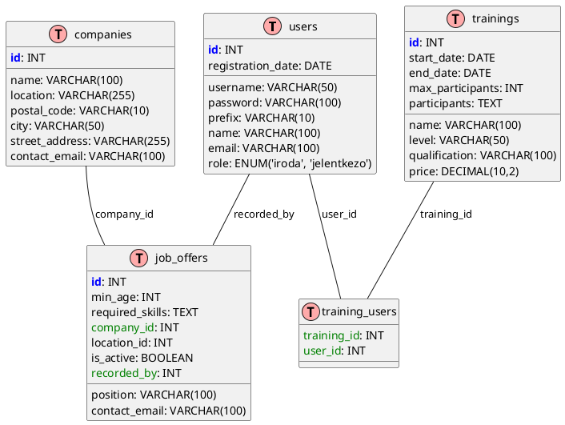

```plantuml
@startuml
!define Table(name) class name << (T,#FFAAAA) >>
!define PK(name) <b><color:blue>name</color></b>
!define FK(name) <color:green>name</color>

Table(users) {
    PK(id): INT
    username: VARCHAR(50)
    password: VARCHAR(100)
    prefix: VARCHAR(10)
    name: VARCHAR(100)
    email: VARCHAR(100)
    role: ENUM('iroda', 'jelentkezo')
    registration_date: DATE
}

Table(companies) {
    PK(id): INT
    name: VARCHAR(100)
    location: VARCHAR(255)
    postal_code: VARCHAR(10)
    city: VARCHAR(50)
    street_address: VARCHAR(255)
    contact_email: VARCHAR(100)
}

Table(job_offers) {
    PK(id): INT
    position: VARCHAR(100)
    min_age: INT
    required_skills: TEXT
    contact_email: VARCHAR(100)
    FK(company_id): INT
    location_id: INT
    is_active: BOOLEAN
    FK(recorded_by): INT
}

Table(trainings) {
    PK(id): INT
    name: VARCHAR(100)
    level: VARCHAR(50)
    qualification: VARCHAR(100)
    price: DECIMAL(10,2)
    start_date: DATE
    end_date: DATE
    max_participants: INT
    participants: TEXT
}

Table(training_users) {
    FK(training_id): INT
    FK(user_id): INT
}

users -- job_offers : "recorded_by"
companies -- job_offers : "company_id"
trainings -- training_users : "training_id"
users -- training_users : "user_id"

@enduml
```