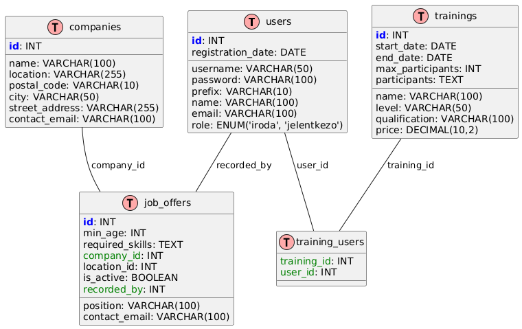

# Adatbázisok beadandó
## Makszim Balázs Imre ENSGO3

## Munkaközvetítő

## Specifikáció

Egy munkaközvetítő iroda adatbázisban tárolja a hozzájuk forduló álláskeresők adatait, a cégek adatait és állásajánlatokat, amelyekkel kapcsolatban állnak, valamint az álláskeresők számára elérhető tanfolyamokat, képzéseket. A rendszert a munkaközvetítő iroda alkalmazottai használják, de a rendszerbe bejelentkezve az álláskeresők is megtekinthetik az aktuális állásajánlatokat és képzéseket. Egy cégnek több telephelye is lehet, így ugyanazon céghez tartozó telephelyet megkülönböztetjük. A képzésekre az álláskeresők jelentkezhetnek (az iroda dolgozói rendelik hozzá).

## Tárolt adatok

* Felhasználók: azonosító, jelszó, előtag, név, e-mail cím, szerepkör, regisztráció dátuma
* Cégek: cégnév, telephely, irányítószám, település, közterület neve, házszám, kapcsolattartó e-mail címe
* Állásajánlatok: munkaköri pozíció, elvárt életkor, elvárt képességek, kapcsolattartó e-mail cím, melyik cég melyik telephelye kínálja az állást, aktuális-e még, ki rögzítette az álláshirdetést
* Képzések: képzés neve, képzés szintje, képzettség megnevezése (teljesítés esetén), képzés ára, kezdés dátuma, befejezés dátuma, maximális létszám, kik vesznek részt a képzésen

## Relációk az adatok között

Egy állásajánlat csak egy cég egy telephelyéhez tartozik, de ugyanaz a cég és telephely több állásajánlatot is hirdethet. Egy képzésre több álláskereső jelentkezhet, és egy álláskereső több képzésre is jelentkezhet.

## EK diagram


## 1. Entitások:

### - Felhasználók (Users)
A `users` entitás azokat a személyeket reprezentálja, akik szerepelnek az ügynökség rendszerében, és két fő típusuk van: az irodai alkalmazottak (iroda) és a jelentkezők (jelentkezo).

**Attribútumok:**
- `id`: Egyedi azonosító (primer kulcs)
- `username`: Felhasználónév
- `password`: Jelszó
- `prefix`: Képesítés előtagja (pl. Dr., Prof.)
- `name`: Név
- `email`: E-mail cím
- `role`: A felhasználó szerepe (`iroda` vagy `jelentkezo`)
- `registration_date`: Regisztráció dátuma

### - Cégek (Companies)
A `companies` entitás a munkaadó cégeket reprezentálja, akik állásajánlatokat adnak fel.

**Attribútumok:**
- `id`: Egyedi azonosító (primer kulcs)
- `name`: Cég neve
- `location`: A cég földrajzi helyzete
- `postal_code`: Irányítószám
- `city`: Város
- `street_address`: Utca, házszám
- `contact_email`: Kapcsolattartó e-mail cím

### - Állásajánlatok (Job Offers)
A `job_offers` entitás az állásajánlatokat tartalmazza, amelyeket a cégek közzétesznek. Az állásajánlatok összekapcsolódnak a cégekkel és a felhasználókkal, akik hozzáadják az ajánlatot.

**Attribútumok:**
- `id`: Egyedi azonosító (primer kulcs)
- `position`: Állás pozíciója
- `min_age`: Minimális életkor
- `required_skills`: Szükséges készségek
- `contact_email`: Kapcsolattartó e-mail
- `company_id`: Cég azonosítója (idegen kulcs a `companies` táblára)
- `location_id`: Lokáció azonosítója
- `is_active`: Aktív státusz
- `recorded_by`: Az állásajánlatot rögzítő felhasználó azonosítója (idegen kulcs a `users` táblára)

### - Képzések (Trainings)
A `trainings` entitás a különböző képzéseket tartalmazza, amelyek a felhasználók számára elérhetők.

**Attribútumok:**
- `id`: Egyedi azonosító (primer kulcs)
- `name`: Képzés neve
- `level`: Képzés szintje
- `qualification`: Képzéshez szükséges képesítés
- `price`: Képzés ára
- `start_date`: Képzés kezdete
- `end_date`: Képzés vége
- `max_participants`: Maximális résztvevők száma
- `participants`: Résztvevők listája (általában ezek a felhasználók)

### - Training_Users (Képzésen résztvevők)
A `training_users` entitás egy kapcsolótábla, amely összekapcsolja a felhasználókat és a képzéseket, amelyekhez csatlakoztak.

**Attribútumok:**
- `training_id`: Képzés azonosítója (idegen kulcs a `trainings` táblára)
- `user_id`: Felhasználó azonosítója (idegen kulcs a `users` táblára)

## 2. Kapcsolatok:

### - Felhasználó és Állásajánlatok
A felhasználók (irodai munkatársak) hozzák létre az állásajánlatokat. A `job_offers` tábla `recorded_by` attribútuma egy idegen kulcs a `users` táblára. Egy felhasználó tehát több állásajánlatot is rögzíthet.

### - Cégek és Állásajánlatok
A cégek `company_id` attribútuma kapcsolódik az `id`-hoz a `companies` táblában, így egy cég több állásajánlatot is tehet közzé.

### - Felhasználók és Képzések
A felhasználók a `training_users` kapcsolótáblán keresztül vehetnek részt a képzéseken. A `training_users` tábla `user_id` és `training_id` idegen kulcsokkal kapcsolódik a `users` és `trainings` táblákhoz.

## 3. Idegen kulcsok és relációk:
- A **`job_offers`** tábla tartalmazza a **`company_id`** és **`recorded_by`** idegen kulcsokat, amelyek összekapcsolják az állásajánlatokat a cégekkel és a felhasználókkal.
- A **`training_users`** tábla kapcsolja össze a felhasználókat és a képzéseket, idegen kulcsokkal.

## Összefoglalás:
Az E-K diagram a következő főbb entitásokat és kapcsolatokat tartalmazza:
1. **Felhasználók** – Minden felhasználó rendelkezik különböző attribútumokkal, és lehet irodai munkatárs vagy jelentkező.
2. **Cégek** – A cégek az állásajánlatokat hozzák létre.
3. **Állásajánlatok** – A cégek által közzétett ajánlatok.
4. **Képzések** – Olyan programok, amelyeken a felhasználók részt vehetnek.
5. **Training_Users** – A kapcsolótábla, amely összekapcsolja a felhasználókat és a képzéseket.

## Relációs sémák
* `users(id, username, password, prefix, name, email, role, registration_date)`
* `companies(id, name, location, postal_code, city, street_address, contact_email)`
* `job_offers(id, position, min_age, required_skills, contact_email, company_id, location_id, is_active, recorded_by)`
* `trainings(id, name, level, qualification, price, start_date, end_date, max_participants, participants)`
* `training_users(training_id, user_id)`


## A program bemutatása

Az alkalmazás `Java` nyelven készült. Grafikus megjelenítésre `JavaFX` csomagot használ, az adatbázis kapcsolatot `jdbc` segítségével hozza létre.
Buildeléshez, csomagkezeléshez `Maven`-t használ.

## Főbb funkciói

### Bejelentkezés

Induláskor egy bejelentkezést lehetővé tevő ablak fogadja a felhasználót. A beírt felhasználónevet és jelszót az adatbázisban tárolt adatok segítségével ellenőrzi. Ha talál egyezést, a felhasználó szerepének megfelelő ablakot jeleníti meg, egyéb esetben hibát dob.

### Jelentkező ablak

Ha jelentkező szerepkörű felhasználő jelentkezett be, akkor kilistázza az elérhető állásokat és képzéseket.

### Fó nézet

Ha irodai dolgozó szerepkörű felhasználó jelentkezett be, akkor 4 fül közül választhat:

- Felhasználók
- Cégek
- Állásajánlatok
- Képzések

### Felhasználók fül

Ezen a fülön lehetőség van hozzáadni és törölni felhasználót. A hozzáadás triviális, viszont a törlés bonyolultabb, mert a felhasználók táblán kívül törölni kell még a képzéseket felhasználókoz rendelő kapcsolótáblából is. Ez az alábbi szerint van megvalósítva az `src/main/java/jobagency/MainScene.java` fájlban van megvalósítva a `deleteUser` függvényben:

```sql
DELETE FROM training_users WHERE user_id = (SELECT id FROM users WHERE username = ?)
```

### Cégek fül

Itt a cégeket látjuk listázva.

### Állásajánlatok fül

Itt az állásajnlaotk kerülnek listázásra.

### Képzések fül

Itt az elérhető képzéseket túl lehetőség van képzéseket hozzáadni, listázni a képzésre jelentkezőket, illetve felhasználókat rendelni a képzésekez.

- Jelentkezők listázása: a jelentkezők listázását az alábbi query valósítja meg a `src/main/java/jobagency/dialogs/ApplicantsDialog.java` fájl `loadApplicantsForTraining` metódusa:

```sql
        SELECT u.name
        FROM users u
        JOIN training_users tu ON u.id = tu.user_id
        JOIN trainings t ON tu.training_id = t.id
        WHERE t.name = ?

```
- Felhasználók képzéshez rendelése: `src/main/java/jobagency/dialogs/AssignUser.java` fájl `assignUserToTraining` metódusa:
```sql
        INSERT INTO training_users (training_id, user_id)
        SELECT t.id, u.id
        FROM trainings t, users u
        WHERE t.name = ? AND u.name = ?
```

- Az adott képzésre még nem jelentkező felhasználókat pedig listázza ugyanabban a fájlban a `loadAvailableUsers` függvény:

```sql
        SELECT u.name
        FROM users u
        WHERE u.id NOT IN (
            SELECT tu.user_id
            FROM training_users tu
            JOIN trainings t ON tu.training_id = t.id
            WHERE t.name = ?
        )
```
